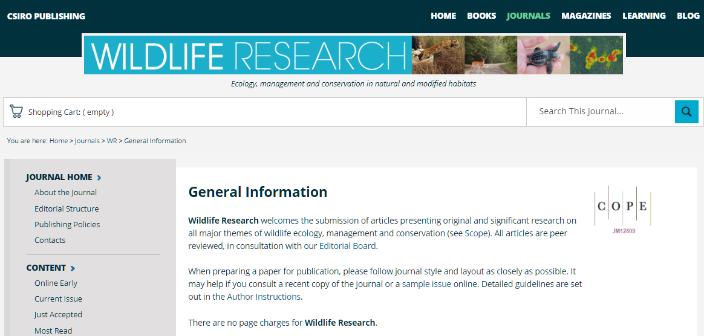

This is a simple blog with my author guidelines for a Ecology manuscript. I would love any comments on how to make this easier for anyone publishing in the [Journal of Wildlife Research](http://www.publish.csiro.au/wr/forauthors).

Overall the Journal of Wildlife Research calls for papers from:

*Quote* - **Wildlife Research** welcomes the submission of articles presenting original and significant research on all major themes of wildlife ecology, management and conservation (see [Scope](http://www.publish.csiro.au/nid/144/aid/444.htm)). All articles are peer reviewed, in consultation with our [Editorial Board](http://www.publish.csiro.au/nid/144/aid/445.htm).

When preparing a paper for publication, please follow journal style and layout as closely as possible. It may help if you consult a recent copy of the journal or a [sample issue](http://www.publish.csiro.au/nid/145/aid/326.htm) online. Detailed guidelines are set out in the [Author Instructions](http://www.publish.csiro.au/wr/forauthors?nid=147&aid=447).

There are no page charges for **Wildlife Research** but open-access publication entails additional charges. See information [here](https://environments.rstudio.com/).

## Resources

**The resources below are copied directly from the WR website but are re-arranged as I work through what is needed for submisssion.**

The work should be presented in concise and clear English. The Introduction must describe the aims of the work and/or the hypothesis being tested, but it should not exceed what is necessary to indicate the reason for the work and its essential background. Sufficient experimental detail should be given to allow assessment of the results and enable the work to be repeated. The Discussion should focus attention on the significance of the results and must discuss their implications for wildlife management.

Additional material of a detailed nature that may be useful to other workers but which is not essential to the printed paper may be lodged as Supplementary Material with the Journal, provided that it is submitted with the manuscript for inspection by the referees. Such material will be made available from the journal´s website and a note to this effect should be included in the paper.

**Type the manuscript double- or 1.5-line-spaced throughout, including references, figure captions, and tables, which should be placed at the end of the document. **

**Clearly numbered figures should also be imported at the end of the document at submission stage. **

**Line numbers must be added (continuous throughout the document), and all pages must be numbered.**

### Summary

In addition to manuscript files, authors are requested to upload a summary text file and an image file for the online Table of Contents. The short summary should also be included in the Word file.

The short summary should capture the essence of the work and put it clearly in a management context. The summary will appear in the Table of Contents on the journal’s website to help wildlife managers, policy makers, consultants and others not directly involved in research to understand its significance, outcomes and applications. The short summary should be three sentences (~60 words) in total, free from jargon, and written at the level of an article in a good newspaper. The first sentence should engage the reader and highlight the importance of the research. The second sentence should describe the aim of the work and the main discovery. The final sentence should describe how the results fit into the bigger picture. An example is shown below.

*Retaliatory killing of carnivores in response to livestock depredation is a major threat to carnivore species worldwide. This study aimed to assess how changes in herding practices affected depredation rates from snow leopards and wolves in the South Gobi, Mongolia, and showed that most losses occurred when herds were left unattended in pastures. We make recommendations for how to minimize human–wildlife conflicts by adjusting livestock husbandry practices.*

### Image

The image file should be a colour photograph or other image that highlights an important aspect of the work. This image will be used in the online Table of Contents, email alerts and RSS feeds to promote the paper and assist in providing a context for the reader. If a photo credit is required please provide details to your Production Editor. The image should be submitted as a 96 dpi JPEG file and must be no wider than 9 cm and no higher than 4 cm.

### Cover letter

[A covering letter must accompany the submission and should include the name, address, fax and telephone numbers, and email address of the corresponding author. The letter should also contain a statement justifying why the work should be considered for publication in the journal, and that the manuscript has not been published or simultaneously submitted for publication elsewhere. Suggestions of possible referees are required during submission. Suggested referees should be [independent](http://www.publish.csiro.au/wr/PublishingPolicies#2) experts in the field. Authors should be aware that approaching suggested reviewers is at the discretion of the Editor. Intentionally falsifying reviewer details will result in rejection of a manuscript.](http://www.publish.csiro.au/wr/forauthors/AuthorInstructions)

### Title

The **title** should be concise, interesting and appropriately informative and should contain sufficient keywords to facilitate retrieval by online search engines. Place names should be avoided unless the geographic location is critical to the point of the paper. 

*An **abridged title** suitable for use as a running head at the top of the printed page and not exceeding 50 letter spaces should also be supplied.*

### Abstract

Abstracts should be no more than 350 words. For research articles and methods papers, the Abstract should state concisely why the study was done, what hypothesis was tested, and how the study was undertaken; should give the principal findings and conclusions; and should highlight the implications for wildlife management or future research. Abstracts of research articles and methods papers should be formatted to include the following labelled sections: *Context*; *Aims*; *Methods*; *Key results*; *Conclusions*; *Implications*. Abstracts of Reviews and Viewpoint articles do not need to be formatted with sections but should still provide a concise overview of the full manuscript.

### Keywords

### Introduction

There are no page charges, except for the reproduction of colour figures. A free PDF file will be supplied to the author on publication of the article. Paper reprints may also be ordered before publication and an order form is sent to the corresponding author with the final page proofs.

**Line drawings and graphs**
Line illustrations prepared using either a draw or chart/graph program should be saved in the following formats: Adobe Illustrator (.ai) (preferred format); encapsulated postscript (.eps); or Excel (.xls). Illustrations created using Powerpoint should be saved in PowerPoint or as Windows metafiles (.wmf); CorelDraw files should be saved as .eps or .ai files; charts created on a Macintosh computer should be saved as .eps, .ps or PICT files; SigmaPlot files should be saved in eps format (postscript printer driver required). **In all cases they should be editable vector graphic files**. Avoid using 3D surface area charts because print quality is often poor. Remove colours from all charts and graphs.

Line illustrations must be of high quality and if not produced using a software package should be drawn using black ink on flexible white board or on drawing or tracing paper, and with regard to the size of the printed page (16.5 by 22 cm). If originals are larger than this they should be photographically reduced and high-quality bromide prints used as originals. Lettering should be in sans-serif type (Helvetica preferred) with the first letter of the first word and any proper names capitalised. The *x*-height of inscriptions after reduction should be 1.2-1.3 mm (capitals 2 mm). Thus, for the preferred reductions of graphs to 30, 40, or 50% of original linear dimensions, the initial x-height of lettering should be 4, 3, or 2.5 mm, respectively. Symbols and grid marks should be the same respective sizes, and curves and axes should then be either 0.8, 0.7, or 0.6 mm thick, respectively. Proportionately smaller sizes of type, symbols, grid marks, and curve thicknesses should be used for lesser reductions (the thickness of all lines on line diagrams must be no less than 1 pt). The following symbols should be used: . The symbols + and × should be avoided. Explanations of symbols should be given in the caption to the figure. Lettering of graphs should be kept to a minimum as excessive lettering within the frame of a graph makes the lines difficult to decipher. Grid marks should point inwards; legends to axes should state the quantity being measured and be followed by the appropriate SI units in parentheses. **Unsatisfactory artwork will be returned for correction.**

##### Materials and methods

###### **Animal ethics**
Papers reporting work with animals must include a reference to the code of practice adopted for the reported experimentation or manipulation and provide details of permits for the study. Editors should ensure that peer reviewers consider ethical and welfare issues raised by the research they are reviewing, and to request additional information from authors where needed. In situations where there is doubt as to the adherence to appropriate procedures or approval by the relevant ethics committee, editors are required to reject these papers. CSIRO Publishing also follows guidelines provided by the [CSIRO Animal Ethics committee](https://www.csiro.au/en/About/Policies-guidelines/Integrity-of-science/Animal-Ethics-Committee-ToR).

**Statistical evaluation of results**
The tests should be described briefly and, if necessary, supported by references. Numbers of individuals, mean values and measures of variability should be stated. It should be made clear whether the standard deviation or the standard error of the mean has been given.

The design and conduct of experiments must be sufficiently explained that readers can judge for themselves the validity of the results. Authors should describe how measurements were made and indicate how treatments were assigned to units or blocks, and the number of replicates. When common experimental designs such as randomised block or split-plot designs are used a reference is not necessary, but it is appropriate to cite a reference for little-used methods or designs, in which case the use of these methods should be justified. The experimental design dictates the proper method of statistical analysis and the basis of assessing the precision of treatment means. The precision achieved should be reported by a standard error of the treatment mean or a coefficient of variation. Wherever possible, the assumptions implicit in the analysis should be checked. Treatment comparisons such as the least significant difference (l.s.d.) may be made when the variance ratio (*F* value) is significant, but authors must be aware of the limitations to the use of multiple comparisons. Ultimately, the statistical analyses should highlight the biological principles embodied in the results.

##### Results

##### Discussion

##### Conclusions (optional)

### Authors’ contributions

#### Acknowledgements

The contribution of colleagues who do not meet all criteria for authorship should be acknowledged. Financial and material support should also be acknowledged. All sources of funding for the research and/or preparation of the article should be listed, and the inclusion of grant numbers is recommended. Authors should declare sponsor names along with explanations of the role of those sources if any in the preparation of the data or manuscript or the decision to submit for publication; or a statement declaring that the supporting source had no such involvement. If no funding has been provided for the research, please include the following sentence: "This research did not receive any specific funding".

### **Conflicts of Interest**

A ´Conflicts of Interest´ section should be included at the end of the manuscript. It should identify any financial or non-financial (political, personal, professional) interests/relationships that may be interpreted to have influenced the manuscript. If there is no conflict of interest, please include the statement "The authors declare no conflicts of interest".

##### Data accessibility

### References

References are cited chronologically in the text by author and date and are not numbered. All references in the text must be listed at the end of the paper, arranged alphabetically; all entries in this list must correspond to references in the text. In the text the names of two coauthors are linked by ´and´; for three or more the first author´s name is followed by ´*et al.*´. No editorial responsibility can be taken for the accuracy of the references; authors are requested to check these with special care.

Titles must be included for all references. Papers that have not been accepted for publication may not be included in the list of references and must be cited either as ´unpublished data´ or as ´pers. comm.´; the use of such citations is discouraged. **Titles of periodicals must not be abbreviated.**

#### Examples

**Citation of references (examples)**
[EndNote](http://www.endnote.com/support/enstyles.asp) and [Reference Manager](http://www.refman.com/support/rmstyles-terms.asp) provide output styles for **Wildlife Research**. References should be in the following formats:

*Journal paper*
Kavanagh, R. P., and Lambert, M. J. (1990). Food selection by the greater glider, *Petauroides volans*: is foliar nitrogen a determinant of habitat quality? *Australian Wildlife Research* **17**, 285-299.

*Chapter in a book*
Lee, A. K., Woolley, P. A., and Braithwaite, R. W. (1982). Life history strategies of dasyurid marsupials. In ´Carnivorous Marsupials´. (Ed. M. Archer.) pp. 1-11. (Royal Zoological Society of New South Wales: Sydney.)

*Whole book*
Strahan, R. (Ed.) (1995). ´The Mammals of Australia.´ (Reed Books: Sydney.)

*Report or bulletin*
Parer, I., Sobey, W. R., and Conolly, D. (1987). Reproduction of the wild rabbit (*Oryctolagus cuniculus*) under varying degrees of confinement. CSIRO Division of Wildlife and Rangelands Research Technical Paper No. 36. (CSIRO: Melbourne.)

Conference Proceedings*
Hone, J., and Pedersen, H. (1980). Changes in a feral pig population after poisoning. In ´Proceedings of the 9th Vertebrate Pest Conference´. (Ed. J. P. Clark.) pp. 176-182. (University of California: Davis, CA.)

### Additional WR notes

**Units**

Authors are requested to use the International System of Units (Système International d´Unités) for exact measurements of physical quantities and where appropriate elsewhere. The double solidus must not be used in complex groupings of units; the negative index form ( e.g. g kg-1 h-1) is preferred.

**Mathematical formulae**

Formulae should be carefully typed with symbols in correct alignment and adequately spaced. If special symbols must be hand-written, they should be inserted with care and identified by pencilled notes in the margin. Judicious use should be made of the solidus to avoid 2-line mathematical expressions wherever possible and especially in the running text. Each long formula should be displayed on a separate line with at least 2 lines of space above and below. Set up complex mathematics using an equation editor.

**Footnotes**
Footnotes are discouraged. They should be used only when essential and should be placed within horizontal rules immediately under the lines to which they refer.

**Tables**
Tables must be numbered with arabic numerals and each must be accompanied by a title. A headnote containing material relevant to the whole table should start on a new line as it will be set in a different font. Tables should be arranged with regard to the dimensions of the printed page (17.5 by 22 cm) and the number of columns kept to a minimum. Excessive subdivision of column headings is undesirable and long headings should be avoided by the use of explanatory notes, which should be incorporated into the headnote. The first letter only of headings to rows and vertical columns should be capitalised. The symbol for the unit of measurement should be placed in parentheses beneath the column heading. Prefixes for units should be chosen to avoid an excessive number of digits in the body of the table or scaling factors in the headings. When scaling factors cannot be avoided, the quantity expressed should be preceded by the power of 10 by which the value has been multiplied. For example, the value 0.05 would appear as 5 under the heading 102 × *N* and the value 500 would appear as 5 under the heading 10-2 × *N*. Horizontal rules should be inserted only above and below column headings and at the foot of the table. Vertical rules must not be used. Each table must be referred to in the text. Only in exceptional circumstances will the presentation of essentially the same data in both tabular and graphical form be permitted; where adequate, the graphical form should be used. Short tables can frequently be incorporated into the text as a sentence or as a brief untitled tabulation. Footnotes in tables should be reserved for specific items in columns.