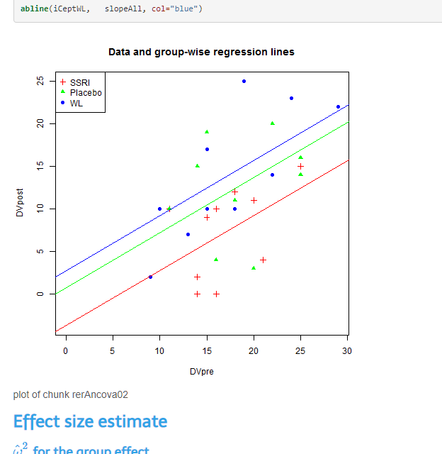

Anova and simple regression models were a hot topic a few years back with publications like these:

| Publication | Figure overview | Web link |
| ----------- | --------------- | -------- |
|             |                 |          |
|             |                 |          |
|             |                 |          |
|             |                 |          |


### Shiny

And stemmed from these papers and other work there is now a collection of shiny apps:

```dcsd

```

And repositories containg code to help work through simple mean testing problems:

```cs

```

### Challenges

A key challenge of doing simple tests using anova or glms is estimating and incorperating modifications that account for one of the three assumptions of regression analysis ... **normality**.

A simple collection of transformations exsist that can be applied to reach the assumption of normality (that can be tested). The general concept is that the data being estimated should not be significantly different to a collection of the same data (mean) as the normal distribution (q-q plot). Here is how I test this:


## Resources

Just a bunch of interesting links for ANOVA's using R, RStudio, RMarkdown and Shiny.

| Overview                                                     | Snap |
| ------------------------------------------------------------ | :----------------------------------------------------------- |
| The basic tool for this is `lm`; note that `aov` is a wrapper for `lm`.http://dwoll.de/rexrepos/posts/ancova.html |  |
| https://www.r-bloggers.com/analysis-of-covariance-%E2%80%93-extending-simple-linear-regression/ |  |
| In particular, if you have some grouping variable (factor), gg, and a continuous covariate xx, the model `y ~ x + g` would fit a main effects ANCOVA model, while `y ~ x * g` would fit a model which includes interaction with the covariate. `aov` will take the same formulas.[here](https://stats.stackexchange.com/questions/51780/how-to-perform-an-ancova-in-r) | Pay particular attention to the `Note` in the help on `aov` |
| http://www.sthda.com/english/wiki/two-way-anova-test-in-r |  |
| https://rstudio-pubs-static.s3.amazonaws.com/318136_38c7ac7c0cae412fbbe32a05e405b60f.html |                  |
| http://www.unh.edu/halelab/BIOL933/Readings/Topic13_Reading.pdf |                                                              |
| https://biol355.github.io/Labs/lab10_lm.html |                                                              |
| http://www.ssnhub.com/stats-for-bio/two-way-ancova-in-r.html |                                                              |
| http://www.ssnhub.com/stats-for-bio/one-way-anova-in-r.html |                                                              |
| http://dzchilds.github.io/aps-data-analysis-L2/regression-simple.html |                                                              |
| http://www.unh.edu/halelab/BIOL933/Readings/Topic13_Reading.pd | |
| https://www.nature.com/articles/srep02259?WT.ec_id=SREP-631-20130801 | |
| http://www.yorku.ca/mack/RN-HowToReportAnFStatistic.html | |

## My notes

For a current publication I am working on I have done some simple tests to compare mean differences across several independent groups. This has many options as I have found out. The full report is here: