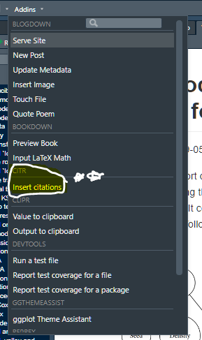
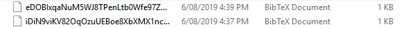

Referencing in R analysis can be tricky. There are a few different options and styles that can be used even before all the standard issues with styles and journals come about. One good option in `RStudio` is to use the `citr` package and the add-on associated.





## Resources

```html
<div class="col-md-4 col-md-offset-0 col-sm-4 col-sm-offset-0 col-xs-12 col-xs-offset-0 text-center">
    <div class="project-card">
        
        <a target="_blank" href="https://github.com/{{- gh-user -}}/{{- gh-project -}}" class="project-link" title="Go to Github Poject Page">
            <span class="fa-stack fa-4x">
                <i class="fa fa-circle fa-stack-2x stack-color"></i>
                <i class="fa fa-user-secret fa-stack-1x fa-inverse"></i>
            </span>
            <h4>{{- gh-project -}}</h4>
            <hr class="seperator">
            <p class="text-muted">The beginnings of a interactive PhD thesis using Markdown. </p>
            <hr class="seperator">
            
            
        </a>
    </div>
</div>
```


## My notes

