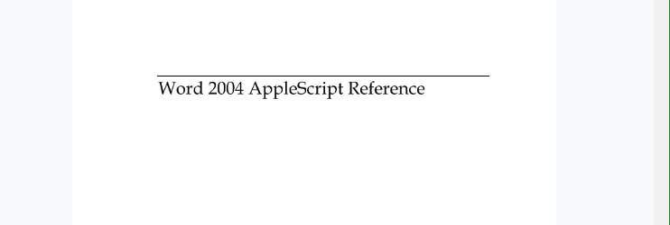

Now this has been a huge barrier for me ever since I become aware of the ability to build reports well doing statistical coding in R. But over the past year it has become "somewhat possible" to do this in RMarkdown and connecting this to word using a series of packages.

Word has always been hard to work with big documents. In particular, if the user has large or numerous images, tables and equations. This makes something like LaTex or Markdown an appealing option but the barrier is:

**you have to learn the coding language!**

And "everyone says that all coding has a steep and un-enjoyable journey to the top."

The thing I was not expecting was for the communication and generation of word documents to be SOOOOO painful. *This has come in leaps and bounds over the past year or so thanks to a key group of developers (Hadley WIckham and YUi "the rockstar"!....and others).*

Here are a few short notes on the issues I found hard in the `docx` world.

## DOCx code!

| CODE                       | MEANING |
| -------------------------- | ------- |
| `bookdown::word_document2` |         |
| `rmarkdown::word_document` |         |
| `rmarkdown::render`        |         |
| `servr::serve.jekyll?`     |         |

<div class="spacer"></div>
<div class="row text-center">
  <div class="col-md-4 col-md-offset-0 col-sm-4 col-sm-offset-0 col-xs-12 col-xs-offset-0 text-center">
    <div class="project-card">
      
      
      <a target="_blank" href="https://github.com/{{- gh-user -}}/{{- gh-project -}}" class="project-link" title="Go to Github Poject Page">
        <span class="fa-stack fa-4x">
          <i class="fa fa-circle fa-stack-2x stack-color"></i>
          <i class="fa fa-terminal fa-stack-1x fa-inverse"></i>
        </span>
        <h4>{{- gh-project -}}</h4>
        <hr class="seperator">
        <p class="text-muted">Here I have forked [dantonnoriega](https://github.com/dantonnoriega/rmarkdown2docx)'s and added some additional notes to extend this blog' </p>
        <hr class="seperator">
        
        
      </a>
    </div>
  </div>

The key information in this project current is:

1. Cross referencing notes on [stack](https://stackoverflow.com/questions/52335126/cross-references-in-rmarkdown-for-word-documents)

```FROM: 
According to [the Rmarkdown guide](https://bookdown.org/yihui/bookdown/figures.html) by the creator @Yihui, `\@ref(figure's label)` should be used to refer to a figure. Therefore, you may use `\@ref(fig:TotalCarStock)`, instead of `\ref{fig:TotalCarStock}`, as shown below:

> As illustrated in Figure \@ref(fig:TotalCarStock), etc, etc.

The notation `\@ref(figure's/table's label)` can be used to make a reference to an image, graph or table, when knitting either `.docx`, `.pdf`, or `.html`.
```

#### Comment solutions from feed

- Actually, I had already tried to implement this. I then got the following output: "As illustrated in Figure @ref{fig:TotalCarStock}, the forecasted car stock is much higher than the actual car stock" – [Laurent Franckx](https://stackoverflow.com/users/2489272/laurent-franckx)[Sep 17 '18 at 9:54](https://stackoverflow.com/questions/52335126/cross-references-in-rmarkdown-for-word-documents#comment91674344_52345023) 
- I oversaw a fundamental solution: your file path may need to be fixed. Currently, your file path is `C:/Usr/WP vehicle stock/TotalCarStock.jpg`, which includes some ` ` (spaces). That seems cause the problem. If possible, could you rename the path so that the file path has no space? (e.g. `C:/Usr/WP-vehicle-stock/TotalCarStock.jpg`) I think `-` (hyphen) is more convenient than `_` (underscore), because sometimes TeX engines fail to read a path with underscores. Although I know that you want a `.docx` output , using `-` is safer way as far as I know. – [Carlos Luis Rivera](https://stackoverflow.com/users/10215301/carlos-luis-rivera) [Sep 17 '18 at 10:50](https://stackoverflow.com/questions/52335126/cross-references-in-rmarkdown-for-word-documents#comment91676210_52345023) 

## Tutorials

There are many other comments about this process and these are the ones I used in combination with my repositories below:

- [RStudio guide again](https://rmarkdown.rstudio.com/articles_docx.html)
- [Cross-referencing](https://stackoverflow.com/questions/52335126/cross-references-in-rmarkdown-for-word-documents): This is just a stack-overflow feed but has some handy code snippets inside.

#### Other repositories

<div class="col-md-4 col-md-offset-0 col-sm-4 col-sm-offset-0 col-xs-12 col-xs-offset-0 text-center">
    <div class="project-card">
      
      <a target="_blank" href="https://github.com/{{- gh-user -}}/{{- gh-project -}}" class="project-link" title="Go to Github Poject Page">
        <span class="fa-stack fa-4x">
          <i class="fa fa-circle fa-stack-2x stack-color"></i>
          <i class="fa fa-file-code-o fa-stack-1x fa-inverse"></i>
        </span>
        <h4>{{- gh-project -}}</h4>
        <hr class="seperator">
        <p class="text-muted">Building on the British Ecological Society guidebook on reporducible code.</p>
        <hr class="seperator">
        
        
      </a>
    </div>
  </div>
  <div class="col-md-4 col-md-offset-0 col-sm-4 col-sm-offset-0 col-xs-12 col-xs-offset-0 text-center">
    <div class="project-card">
    
      <a target="_blank" href="https://github.com/{{- gh-user -}}/{{- gh-project -}}" class="project-link" title="Go to Github Poject Page">
        <span class="fa-stack fa-4x">
          <i class="fa fa-circle fa-stack-2x stack-color"></i>
          <i class="fa fa-user-secret fa-stack-1x fa-inverse"></i>
        </span>
        <h4>{{- gh-project -}}</h4>
        <hr class="seperator">
        <p class="text-muted">The beginnings of a interactive PhD thesis using Markdown. </p>
        <hr class="seperator">
        
        
      </a>
    </div>
  </div>

</div>

# Description

This set of scripts help convert the output of `Rmd` files to `docx` files. It is done by creating a clean `html` file, then opening, converting, and saving the `html` to `docx` using [Applescript and Microsoft Word](https://www.dropbox.com/s/4bwwsgod27w1fjo/word-2004-applescript-reference.pdf?dl=0).



*This maybe an issue as I do not have word 2004!!*

The workhorse script is a `makefile`. Just change the variables to convert any `Rmd` to `docx`. However, only clean (not standalone) `html` files will fully convert. There are some caveats (outlined below) if you want to keep a standalone `html` file.

In this repo, the `makefile` converts `example.Rmd` to `example.docx`.

## The output files

- `example.html`
- `example.docx`

## The main support file

- `html2docx.sh`

The `makefile` automatically downloads the `html2docx.sh` conversion script using `wget` if it's missing. (Requires unix command-line tool `wget` to download if missing.)

## Optional support files

- `chicago-author-date.csl`
- `bibliography.bib`

These files are listed to show that folks can cite references (useful for academics). To learn more about these RMarkdown `yaml` options, see this [RStudio post](http://rmarkdown.rstudio.com/authoring_bibliographies_and_citations.html).

# Requirements

1. Microsoft Word for Mac in your Applications folder. This has been built and testing using Microsoft Word for Mac, Version `15.20`.
2. `R` with packages `rmarkdown` and `knitr`.
3. An understanding of how to use GNU Make and terminal commands.

# How to Use

There are two options for going from `Rmd` to `docx`. The first `make` option is `all` and the second is `alt`. But before anything, make sure the `makefile` variables are set up accordingly. Simply change the `RMD_NAME` variable to suite your needs:

```
RMD_NAME = example.Rmd
```

In this case, the `Rmd` file of interest is `example.Rmd`.

## Option 1: `all`

Simply run

```
make all
```

Although one can knit an `html` file from a `Rmd` file---letting knitr run the `pandoc` step---there is a caveat.

> output options `self_contained` **must** be `FALSE`. Otherwise, Microsoft Word will crash during the `html` to `docx`conversion. Keep in mind that this is the default option for `rmarkdown`. But I force it to be true in the `makefile`.

## Option 2: `alt`

You cannot convert a self contained (aka standalone) `html` file to a `docx`. (At least I've found that it always crashes.) If you want the option to have a standalone `html` file, then then we use option `alt`.

Simply run

```
make alt
```

This will produce a clean (not self contained) `html`, create a `docx` file, then replace the clean `html` file with a standalone file.

It's a little hackish, but it allows you to create a `docx` AND keep a standalone `html` file.

# First Run, Word will ask for permission

When you first run the script, do not worry if Word asks for permissions. Once you give Word access to the folder and files, it should run just fine and without asking again every time after.

## My notes

I’m really not sure how to start these notes but I am sure there will be many in time. For now they are just snippets of fleeting information.

### The YAML content

I did not realise how touching the `tabs` and spaces were in the `YAML` header of any `.Rmd` file.

### Tidy up R-code

The code rendered into a word document tends to be justified and messy. You can not just use the templating options of `bookdown` and `rmarkdown` as I tried and it didn’t seem to want to play ball.

### Shortcomings

#### Footnotes

Footnotes, not matter what, go to the bottom of the page. Just how html files work.

### Thanks

A special thanks to [Andrew Heiss](http://github.com/andrewheiss) and [Danton Noriega](https://github.com/dantonnoriega), from whom I've learned almost all I know about `makefiles` and converting markdown files to `docx` files.

  <div class="col-md-4 col-md-offset-0 col-sm-4 col-sm-offset-0 col-xs-12 col-xs-offset-0 text-center">
    <div class="project-card">
    
      <a target="_blank" href="https://github.com/{{- gh-user -}}/{{- gh-project -}}" class="project-link" title="Go to Github Poject Page">
        <span class="fa-stack fa-4x">
          <i class="fa fa-circle fa-stack-2x stack-color"></i>
          <i class="fa fa-user-secret fa-stack-1x fa-inverse"></i>
        </span>
        <h4>{{- gh-project -}}</h4>
        <hr class="seperator">
        <p class="text-muted">The beginnings of a interactive PhD thesis using Markdown. </p>
        <hr class="seperator">
        
        
      </a>
    </div>
  </div>

A package with the flowing functions:

~~~markdown
---
title: "Numbers in engineering format"
output: rmarkdown::html_vignette
vignette: >
  %\VignetteIndexEntry{Numbers in engineering format}
  %\VignetteEncoding{UTF-8}
  %\VignetteEngine{knitr::rmarkdown}
---

```{r setup, echo = FALSE, message = FALSE}
knitr::opts_knit$set(root.dir = "../")
knitr::opts_chunk$set(
  echo = TRUE, # varies from one Rmd to another
  message = FALSE,
  warning = FALSE,
  collapse = TRUE,
  comment = "#>",
  error = TRUE
)
knitr::knit_hooks$set(inline = function(x) {
  if (!is.numeric(x)) {
    x
  } else if (x >= 10000) {
    prettyNum(round(x, 2), big.mark = ",")
  } else {
    prettyNum(round(x, 2))
  }
})
options(tibble.print_min = 8L, tibble.print_max = 8L)
```

## Introduction

Packages used in this vignette. 

```{r}
library("dplyr")
library("knitr")
library("docxtools")
```

This vignette demonstrates the use of two functions from the *docxtools* package: 

- `format_engr()` for formatting numbers in engineering notation  
- `align_pander()` for aligning table columns using a simple pander table style 

The primary goal of `format_engr()` is to present numeric variables in a data frame in *engineering format*, that is, scientific notation with exponents that are multiples of 3. Compare: 

|syntax         |expression           |
|---------------|---------------------|
|computer       |$1.011E+5$           | 
|mathematical   |$1.011\times10^{5}$  |
|engineering    |$101.1\times10^{3}$  |


## format_engr()

This example uses a small data set, `density`, included with docxtools, with temperature in K, pressure in Pa, the gas constant in J kg^-1^K^-1^, and density in kg m^-3^.   

```{r}
density
```

Four of the variables are numeric. The `date` variable is of type "double" but class "Date", so it is not reformatted. 

```{r}
map_chr(density, class)
map_chr(density, typeof)
```

Usage is `format_engr(x, sigdig = NULL, ambig_0_adj = FALSE)`. The function returns a data frame with all numeric values reformatted as character strings in engineering format with math delimiters `$...$`.  

```{r}
density_engr <- format_engr(density)
density_engr
```

The formerly numeric variables are now characters.  Non-numeric variables are returned unaltered.

```{r}
map_chr(density_engr, class)
```

The math formatting is applied when the data frame is printed in the output document.  For example, we can use `knitr::kable()` to print the formatted data.  

```{r}
kable(density_engr)
```

The function is compatible with the pipe operator. 

```{r}
density_engr <- density %>%
  format_engr()
kable(density_engr)
```

Comments: 

- as illustrated by the temperature column, scientific notation is omitted when the exponent is 0, 1, or 2 
- trailing zeros after a decimal point are significant 

## Significant digits

`format_engr()` has three arguments: 

- `x`, a data frame with at least one numerical variable. 
- `sigdig`, an optional vector of significant digits. Default is 4. 
- `ambig_0_adj`, an optional logical to adjust the notation in the event of ambiguous trailing zeros. Default is FALSE. 

The `sigdig` argument can be a single value, applied to all numeric columns. 

```{r}
density_engr <- format_engr(density, sigdig = 3)
kable(density_engr)
```

Alternatively, significant digits can be assigned to every numeric column. A zero returns the variable in its original form.   

```{r}
density_engr <- format_engr(density, sigdig = c(5, 4, 0, 5))
kable(density_engr)
```

## Ambiguous trailing zeros

Subset the data to look at just the numerical variables. 

```{r}
x <- density %>%
  select(T_K, p_Pa, R, density)
```

Print the data with incrementally decreasing significant digits. 

```{r}
kable(format_engr(x, sigdig = 4), caption = "4 digits")
```

Three digits creates no ambiguity. 

```{r}
kable(format_engr(x, sigdig = 3), caption = "3 digits")
```

With 2 digits, we have three columns with ambiguous trailing zeros. 

```{r}
kable(format_engr(x, sigdig = 2), caption = "2 digits")
```

By setting the `ambig_0_adj` argument to TRUE, scientific notation is used to remove the ambiguity. 

```{r}
kable(format_engr(x, sigdig = 2, ambig_0_adj = TRUE), caption = "Removing ambiguity")
```

The ambiguous trailing zero adjustment is applied only to those variables for which the condition exists. For example, consider these data without the adjustment,

```{r}
kable(format_engr(x, sigdig = c(4, 2, 0, 3), ambig_0_adj = FALSE))
```

The same numbers with `ambig_0_adj = TRUE`, 

```{r}
kable(format_engr(x, sigdig = c(4, 2, 0, 3), ambig_0_adj = TRUE))
```

and only the pressure variable has a reformatted power of ten because it is the only variable that had ambiguous trailing zeros.
~~~


  