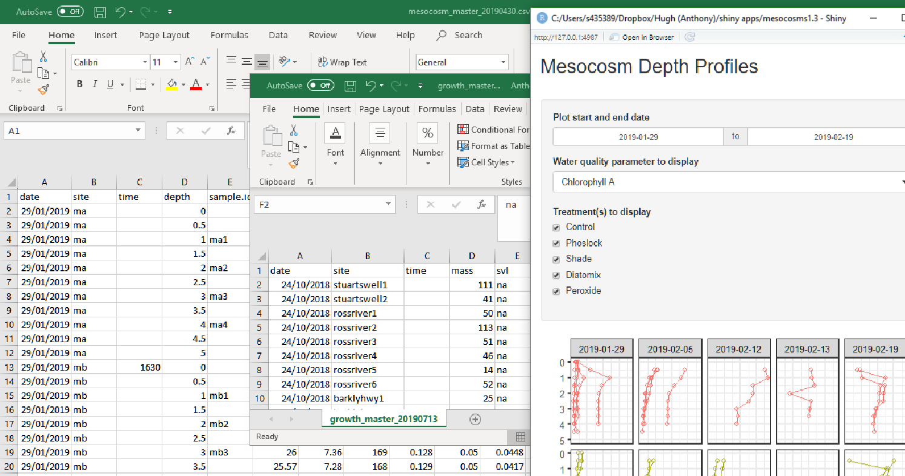

## Tutorials

Its a shiny place to be. Discover shiny [here](https://www.rstudio.com/products/shiny/)

- All my key resources for shiny can now be found in the awesome-r repository [here]() or my version of the book on the website www.ssnhub.com/awesome-shiny

## My notes

This is a blog example of a process I have recently done to fit a simple shiny application to a fellow students' dataset using another projects shiny app. 

I am writing out this process because I think that these sorts of tasks are much longer than we charge for or can account for in graduate research however they provide strong evidence of high level problem solving I think.

