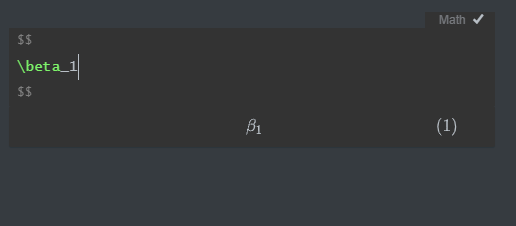

An important note here is that for some markdown equations using `$$ $$` can have issues rendering as I had with `gps` co-ordinates recently.

These equations will not work without installing MathJax to use when compiling your html documents for the web. Here are a few previous posts that helped me work through it:

- Math on the web [here]()
- The one minute rundown for jekyll [here]()

## Getting started with equations

We can write fractions: $\frac{2}{3}$. We can also handle things like estimated population growth rate, e.g., $\hat{\lambda}=1.02$. And, $\sqrt{4}=2$.

$$\alpha, \beta,  \gamma, \Gamma$$

$$a \pm b$$
$$x \ge 15$$
$$a_i \ge 0~~~\forall i$$

## Matrix

$$A_{m,n} =
 \begin{pmatrix}
  a_{1,1} & a_{1,2} & \cdots & a_{1,n} \\
  a_{2,1} & a_{2,2} & \cdots & a_{2,n} \\
  \vdots  & \vdots  & \ddots & \vdots  \\
  a_{m,1} & a_{m,2} & \cdots & a_{m,n}
 \end{pmatrix}$$

## Statistics

To calculate the **mean** of \textit{n} observations of variable \textit{x}, you can use: $$\bar{x} = \frac{1}{n} \sum_{i=1}^{n}x_{i}$$

Note that this equation looks quite nice above where it's in display math mode. It is more compact but not quite as nice looking if we present it using inline mode, e.g., $\bar{x} = \frac{1}{n} \sum_{i=1}^{n}x_{i}$.

Let's do the same with the equation for **variance**. First the inline version, which is 
$\sigma^{2} = \frac{\sum\limits_{i=1}^{n} \left(x_{i} - \bar{x}\right)^{2}} {n-1}$. And then the display mode version: 
$$\sigma^{2} = \frac{\sum_{i=1}^{n} 
  \left(x_{i} - \bar{x}\right)^{2}}
  {n-1}$$

Next, it's good to look at the equation for **covariance** to see how it is just a generalization of variance to two variables. An inline version of the equation is $cov_{x,y} = \frac{\sum\limits_{i=1}^{n}{(x_i-\overline{x}) \cdot (y_i-\overline{y})} }{n-1}$. And, the display mode is: $$cov_{x,y} = \frac{\sum\limits_{i=1}^{n}{(x_i-\overline{x}) \cdot (y_i-\overline{y})} }{n-1}$$

And, finally, we'll end with the **standard deviation**. Here's the inline version, $\sigma = \sqrt{\frac{\sum\limits_{i=1}^{n} \left(x_{i} - \bar{x}\right)^{2}} {n-1}}$. And here's the display version.
$$\sigma = \sqrt{\frac{\sum\limits_{i=1}^{n} \left(x_{i} - \bar{x}\right)^{2}} {n-1}}$$

There are helpful online editors to help you learn code for various equations you might want to include. I have found the one at: http://visualmatheditor.equatheque.net/VisualMathEditor.html to be very useful. You can work out the code there and then copy it over to your RMarkdown document in between dollar signs (1 or 2 on either end depending on whether you want the equation in line or in display mode).
$$
y_i = \beta_0 + \beta_1(site_i) + \beta_2(treatment_i) + \epsilon_i
$$

And then the code can be found in an online editor like this one:

<iframe width="650" height="400" scrolling="yes" frameborder="no"  src="http://visualmatheditor.equatheque.net/VisualMathEditor.html"> </iframe>
Here is a gist or two:

